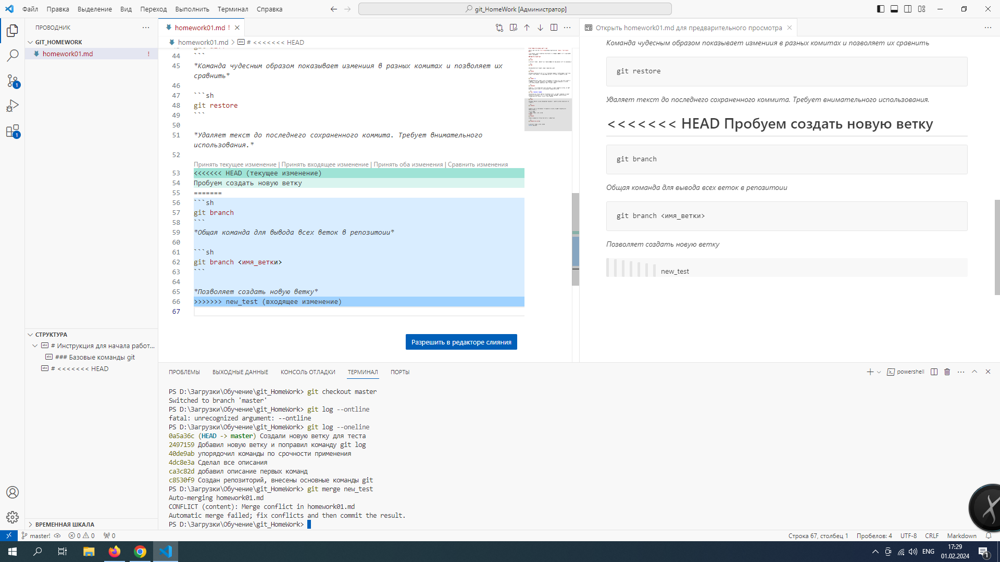

# Инструкция для начала работы с git

Скачать git можно по [этой ссылке](https://git-scm.com  "Нажми, чтобы скачать git")

Перед началом работы необходимо представиться и указать папку в которой git будет следить за файлами.

### Базовые команды git

```sh
git init
```
*Позволяет создать репозиторий в данной папке для дальнейшего контроля изменений.*

```sh 
git add
```

*Команда позволяет добавить файл к наблюдению git*

```sh 
git status
```
*Команда необходима для просмотра отслеживания файла и статуса файла в настоящий момент. Можно увидеть сосхранен файл или нет, состояния сохранения версий*


```sh
git commit -m
```
*Команда позволяет создать комит (сохранение состояния) которому можно вернуться в будущем. -m атрибут необходим для добавления сообщения(описания) к комиту. Перед использованием обязательно надо сохранить файл*

```sh
git checkout
```
*С помощью этой команды git может возвращать к ранее создаными комитам. атрибут master позволяет вернуться к последнему созданному комиту*

```sh
git log --onеline --graph
```
*Необходима для вызова списка сохраненных комитов. атрибут --oneline сокращает количество выводимых строк, что сильно упрощает навигацию между комитами.
--graph позволяет увидеть ветки в виде графика*

```sh
git diff
```
*Команда чудесным образом показывает измениия в разных комитах и позволяет их сравнить*

```sh
git restore
```

*Удаляет текст до последнего сохраненного коммита. Требует внимательного использования.*

```sh
git branch
```
*Общая команда для вывода всех веток в репозитоии*

```sh
git branch <имя_ветки>
```

*Позволяет создать новую ветку*

## Сейчас мы опишем что такое конфликт при слиянии веток

В случае если в двух ветка после сохранения начать писать (править) в одних и тех же строках, то при попытке слить ветки получтся конфликт. 
* Выглядит он так:



